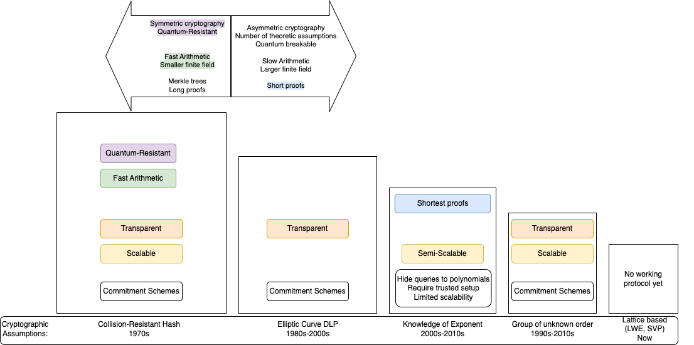

## Proofs of Computational Integrity

## General idea behind Zero-Knowledge Proof

Zero-Knowledge Proofs (ZKP) are cryptographic methods used to prove knowledge about a piece of data (problem or statement) to verifier, without
revealing the data itself by a prover. ZKP assumes that series of actions can only be performed accurately by a prover if he or she is not guessing.
In other case a prover will be proven wrong by the verifier's test with a high degree of probability.

### Intuitive example of a ZKP

The most common example, used to describe ZKP concept, is the strange cave of Ali Baba. Imagine a cave with one entrance that has two 
paths A and B. Ends of these paths are connected together. However, they are separated with a door, which opens only if someone knows the 
secret. Outside a cave are two people Bob and Alice. Alice is a prover and Bob is a verifier. Alice enters a cave to prove Bob that she knows 
the secret. She chooses randomly path A or B. At the same time Bob is still outside a cave and he does not know what path has been chosen. After
that Bob enters a cave and asks Alice to come outside appearing from path A or B. Alice has 50% chance to fool Bob, because Bob can ask Alice
to come outside through the same path Alice chosen earlier. Therefore this task is repeated many times in order to reduce chances of Alice 
cheating.

- Different introduction into ZK, not so trivial: https://youtu.be/3uSG-Xp5slM?si=fWT2JZlz6-zmSeSO

### Probabilistics in ZKP

1. The prover conceals each vertex of a 3-coloring solution of the graph, making it unobservable to the verifier.
2. The verifier selects an edge of the graph at random, and the prover then reveals the two vertices of this chosen edge. The prover demonstrates that
   these two vertices are of different colors. If they are the same color, it indicates that the prover is being dishonest and does not possess the correct
   solution. If the vertices are of different colors, the verifier gains partial (but not complete) confidence in the prover’s honesty. Notably, the prover
   has a probability of $(E-1)/E$ of cheating successfully, where $E$ represents the number of edges in the graph. This process then proceeds to the next step.
4. The prover once more hides all vertices of the graph and randomly permutes the assignment of the three colors in the solution. Again, the verifier selects
   a random edge to verify its validity (the two vertices must be differently colored). While the prover might still be cheating, the probability that the
   prover successfully deceives in both rounds is $((E-1)/E) * ((E-1)/E) = ((E-1)/E)^2$, which is lower than the probability in the previous round.
5. By repeating this process for multiple rounds (n), the likelihood of the prover being able to deceive the verifier can be reduced to a negligible level.
   Probability of Prover Cheating: $(((E - 1) / E) ^ n)$

## First introduction of ZK proof

Zero-Knowledge Proof was first introduced in a 1985 MIT paper from Shafi Goldwasser and Silvio Micali called “The Knowledge Complexity of Interactive 
Proof-Systems”. In mentioned paper researchers presented three fundamental properties that define Zero-Knowledge Proofs:

- Completness - if statement is true, then a verifier can be convinced by a prover that he or she also posseses knowledge about the truth of statement;

- Soundness - if a statement is false, then no prover can convince a verifier that they possess knowledge about the correct statement;

- Zero-knowledge - if the statement or solution is true, then a verifier learns nothing more than it is true.

In 1991 a valid general zero-knowledge proof system was proposed by another group of researchers: Goldreich, Micali, and Widgerson in order to verify that
a prover knows solution of the 3-coloring graph problem without revealing it to a verifier. If the order of the coloring of the vertices of the graph
was different in each round, a verifier was unable to link the edges revealed between subsequent rounds to construct a solution to this problem.
In other words they showed that a verifier could not identify actual solution to the 3-coloring solution. As a result it can be noticed that proposed protocol 
has three fundamental properties of ZKP. 

“Given a graph G, can you color the nodes with <3 colors such that for every edge $\{u, v\}$ we have $f(u) \neq f(v)$?” 

By creting protocol for these  NPComplete problem they succesfully proven that all statements in NP can be verified through their zero-knowledge protocol.

These revelation leads us to more efficient and more applicable verisions of ZKP called zk-SNARKs (Zero Knowledge Succinct Non-interactive Argument of
Knowledge). This type of ZKP can be verified in a matter of milliseconds with a proof length of a hundreds of bytes. The “non-interactive” aspect refers to
the fact that a prover can send a single message to a verifier, without having many back-and-forth interactions. zk-SNARKs were fist introduced in 2011 year
by: Nir Bitansky, Ran Canetti, Alessandro Chiesa, and Eran Tromer in their paper “From Extractable Collision Resistance to Succinct Non-Interactive Arguments
of Knowledge, and Back Again”. They proved that proposed an extractable collision hash function (ECRH) implies that a modified version of “Di Crecsenzo and Lipmaa’s
protocol is a succinct non-interactive argument for NP. This modified version odf the protocol is called SNARKs.

interactive proof model by Goldwasser, Micali, and Rackoff in 1985 - https://en.wikipedia.org/wiki/Interactive_proof_system
  (also well described in https://fisher.wharton.upenn.edu/wp-content/uploads/2020/09/Thesis_Terrence-Jo.pdf pages: 4-6)

## Adjustments needed for Blockchain

- Privacy (Zero-Knowledge) - respect the privacy of prover's data
- Scalability - log(N) verification, N log(N) proving
- Universality - applicable to general computation
- Transparency - no trusted setup
- State-of-the-art cryptography - e.g. post-quantum secure

STARK = Scalable Transparent Argument of Knowledge  
SNARK = Succinct Non-Interactive Argument of Knowledge

### STARK vs SNARK

| STARK                                                    | SNARK                                       |
|----------------------------------------------------------|---------------------------------------------|
| - Transparent - no trusted setup                         | - Non-Interactive - proof is single message |
| - Scalable - verification in log(N), proving in N log(N) | - Succinct - verification in log(N)         |
| - Succinct setup - at most log(N)                        | - Setup - at least in linear time           |

Gotcha:
Non-interactive STARK is transparent SNARK
Transparent SNARK with succinct setup is STARK

#### Reason for having many different implementation

They do the following things differently:

1. Method of Arithmetization 
2. Enforcement of low degreenes
3. Cryptographic assumptions used to get low degreenes

### Characteristics of various concepts

## Mathematics behind SNARK

https://fisher.wharton.upenn.edu/wp-content/uploads/2020/09/Thesis_Terrence-Jo.pdf chapter 3

## Mathematics behind STARK

### Arithmetization

Arithmetization - use of *low degree polynomials* to argue about computation
- Goes back to 1930's and modified for interactive proof systems in late 1980's

Polynomial of *degree d*: $P(X) = \sum_{i \leq d} a_iX^i$  

Function $f: S \to \mathbb{F}$ : "lookup table" having a value from $\mathbb{F}$ for each each element from the domain $S$.  
Function is of *degree d*, if it evaluates a *degree d* polynomial: $\forall x_0 \in S, f(x) = P(x)$

Fact: Two distinct polynomials of *degree d* interact at at most *d* points, so two distinct functions of *degree d* can interact on very low number of points if only the domain is big enough.

The fallowing arithmetization will be presented using AIR (Algebraic Intermediate Representation) approach, but there are other options, like R1CS (Rank-1 Constraint System).

### Integrity and succinctness

Prover represents the trace of the program, or any other data, as polynomial and then uses *error correcting code* technique to add redundancy and create function of the same degree, but evaluated on much bigger domain - this function is called $f$.  
Prover needs to create yet another function, $g$, which is of a higher degree than $f$, and evaluate it on the same domain as $f$.  
Then prover commits to these two such functions, $f, g$, and allows the verifier to conduct the verification, which takes up to $O(log(N))$

Veryfier runs the following test:
1. selects random $x_0$ belonging to the domain extended using error correcting code
2. queries $f(x_0)$ and assigns the result to $\alpha$
3. queries $g(x_0)$ and assigns the result to $\beta$
4. accepts the prover's claim only if $C(\alpha) = \beta D(x_0)$

$C(X)$ - the constraint polynomial - vanishes when specified constraints are fulfilled  
$D(X)$ - the domain polynomial - vanishes on domain of interest 

### Example

Prover has a list of $10^6$ integers, all of them from range $\{1, ..., 10\}$.  
Verifier wants to check the prover's claim, without the need of iterating over all of the list entries.

Prover commits to the two following functions:
- $f$, being of degree $10^6$ and evaluated over $10^9$ points
- $g$, degree $10^7-10^6$ and also evaluated over $10^9$ points

Verifier sets polynomials $C(X), D(X)$ in the following way:
- $C(X) = (X-1)(X-2)...(X-10)$ - vanishes on any value from $\{1, ..., 10\}$
- $D(X) = (X-1)(X-2)...(X-10^6)$ - same like above, but for the claim domain, which is $\{1, ..., 10^6\}$

#### Completeness

The prover is honest and says the truth.

Let $P(X)$ be the interpolant of $f$.  
Then $C(P(X))$ vanishes on $x_0 \in \{1, ..., 10^6\}$.

*Corollary:* $Q(X) = C(P(X))$ vanishes on domain $\{1, ..., 10^6\}$ only if $\exists Q'(X), deg(Q') = deg(Q) - deg(D) \leq 10^7-10^6$, such that $Q'(X)D(X) = Q(X)$.

If prover is honest, then $g$ is the evaluation of $Q'(X)$, because $C(\alpha) = C(P(x_0)) = Q(x_0) = Q'(x_0)D(x_0) = \beta D(x_0)$. 

#### Soundness

The prover cheats, so $\exist x_0, f(x_0) \notin \{1, ..., 10\}$.

Let $P(X)$ be the interpolant of $f$  
$C(P(X))$ doesn't vanish on all $x_0 \in \{1, ..., 10^6\}$  
$\forall Q'(X), Q'(X)D(X)=0$  on all $x_0 \in \{1, ..., 10^6\}$, because $D(x_0)=0$  
So for any $Q'(X)$ of degree $10^7-10^6$, the polynomial $Q'(X)D(X)$ is distinct from $C(P(X))$ and of degree $10^7$  
The evaluations of $C(P(X))$ and $Q'(X)D(X)$ disagree on $10^9-10^7$ points out of $10^9$ points  

For random $x_0 \in \{1, ..., 10^6\}$, test fails with probability of 99%. The probability can be higher, if $f, g$ are selected accordingly.

#### Zero Knowledge

Prover appends to the initial list of integeres a few (e.g. 10) random entries, so the corresponding polynomial is of $deg = 10^6+10$ and any values after first $10^6$ entries are fully random.

Verifier selects random $x_0 \in \{10^6+1, ..., 10^9\}$

#### Enforcing low-degreeness

To the right more homomorphic strucure, where you can add things
To the left more unstructured, so quantum resistance, but hard to add anything 

### Code for STARK

Jupiter notebooks with lectures to it:

https://starkware.co/stark-101/

Proof recursion -> prover prooing, that it run a verifier - it can go down many times

Proof systems

