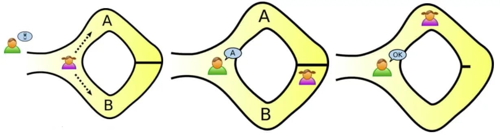
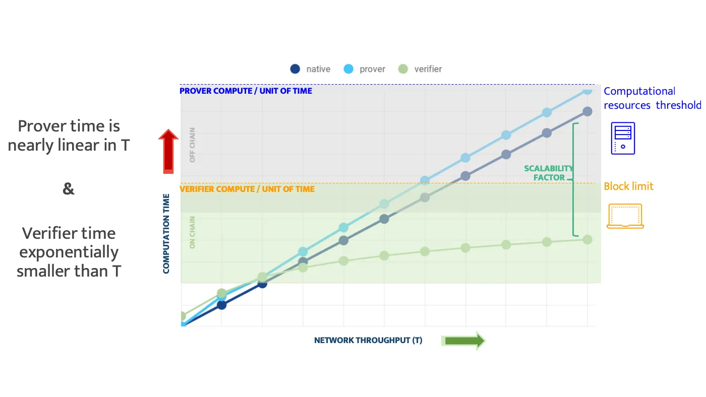

**Course: Cryptography methods in data science**

**Authors: Marcin Wardyński, Bartłomiej Jamiołkowski** 

## General idea behind Zero-Knowledge Proof

Zero-Knowledge Proofs (ZKP) are cryptographic methods used to prove knowledge about a piece of data (problem or statement) to verifier, without
revealing the data itself by a prover. ZKP assumes that series of actions can only be performed accurately by a prover if he or she is not guessing.
In other case a prover will be proven wrong by the verifier's test with a high degree of probability.

### Intuitive example of a ZKP

The most common example, used to describe ZKP concept, is the strange cave of Ali Baba. Imagine a cave with one entrance that has two 
paths A and B. Ends of these paths are connected together. However, they are separated with a door, which opens only if someone knows the 
secret. Outside a cave are two people Bob and Alice. Alice is a prover and Bob is a verifier. Alice enters a cave to prove Bob that she knows 
the secret. She chooses randomly path A or B. At the same time Bob is still outside a cave and he does not know what path has been chosen. After
that Bob enters a cave and asks Alice to come outside appearing from path A or B. Alice has 50% chance to fool Bob, because Bob can ask Alice
to come outside through the same path Alice chosen earlier. Therefore this task is repeated many times in order to reduce chances of Alice 
cheating.

### Academic example of ZKP
One of the first valid general ZKP systems was proposed by Goldreich, Micali, and Widgerson, specifically to verify that a prover knew the 3-coloring of a graph.
The 3-coloring graph problem is an NP-Complete problem stated as follows:

“Given a graph G, can you color the nodes with <3 colors such that for every edge $\{u, v\}$ we have $f(u) \neq f(v)$?” 

Proposed ZKP system works in the following way:
1. The prover conceals each vertex of a 3-coloring solution of the graph, making it unobservable to the verifier.
2. The verifier selects an edge of the graph at random, and the prover then reveals the two vertices of this chosen edge. The prover demonstrates that
   these two vertices are of different colors. If they are the same color, it indicates that the prover is being dishonest and does not possess the correct
   solution. If the vertices are of different colors, the verifier gains partial (but not complete) confidence in the prover’s honesty. Notably, the prover
   has a probability of $(E-1)/E$ of cheating successfully, where $E$ represents the number of edges in the graph. This process then proceeds to the next step.
4. The prover once more hides all vertices of the graph and randomly permutes the assignment of the three colors in the solution. Again, the verifier selects
   a random edge to verify its validity (the two vertices must be differently colored). While the prover might still be cheating, the probability that the
   prover successfully deceives in both rounds is $((E-1)/E) * ((E-1)/E) = ((E-1)/E)^2$, which is lower than the probability in the previous round.
5. By repeating this process for multiple rounds (n), the likelihood of the prover being able to deceive the verifier can be reduced to a negligible level.
   Probability of Prover Cheating: $(((E - 1) / E) ^ n)$

## First introduction of ZK proof

Zero-Knowledge Proof was first introduced in a 1985 MIT paper from Shafi Goldwasser and Silvio Micali called “The Knowledge Complexity of Interactive 
Proof-Systems”. In mentioned paper researchers presented three fundamental properties that define Zero-Knowledge Proofs:

- Completness - if statement is true, then a verifier can be convinced by a prover that he or she also posseses knowledge about the truth of statement;

- Soundness - if a statement is false, then no prover can convince a verifier that they possess knowledge about the correct statement;

- Zero-knowledge - if the statement or solution is true, then a verifier learns nothing more than it is true.

In 1991 a valid general zero-knowledge proof system was proposed by another group of researchers: Goldreich, Micali, and Widgerson in order to verify that
a prover knows solution of the 3-coloring graph problem without revealing it to a verifier. If the order of the coloring of the vertices of the graph
was different in each round, a verifier was unable to link the edges revealed between subsequent rounds to construct a solution to this problem.
In other words they showed that a verifier could not identify actual solution to the 3-coloring solution. As a result it can be noticed that proposed protocol 
has three fundamental properties of ZKP. By creting protocol for these  NP-Complete problem they succesfully proven that all statements in NP can be verified 
through their zero-knowledge protocol.

These revelation leads us to more efficient and more applicable verisions of ZKP called zk-SNARKs (Zero Knowledge Succinct Non-interactive Argument of
Knowledge). This type of ZKP can be verified in a matter of milliseconds with a proof length of a hundreds of bytes. The “non-interactive” aspect refers to
the fact that a prover can send a single message to a verifier, without having many back-and-forth interactions. zk-SNARKs were fist introduced in 2011 year
by: Nir Bitansky, Ran Canetti, Alessandro Chiesa, and Eran Tromer in their paper “From Extractable Collision Resistance to Succinct Non-Interactive Arguments
of Knowledge, and Back Again”. They proved that proposed an extractable collision hash function (ECRH) implies that a modified version of “Di Crecsenzo and Lipmaa’s
protocol is a succinct non-interactive argument for NP. This modified version odf the protocol is called SNARKs.

## Adjustments needed for Blockchain

- Privacy (Zero-Knowledge) - respect the privacy of prover's data
- Scalability - log(N) verification, N log(N) proving
- Universality - applicable to general computation
- Transparency - no trusted setup
- State-of-the-art cryptography - e.g. post-quantum secure

STARK = Scalable Transparent Argument of Knowledge  
SNARK = Succinct Non-Interactive Argument of Knowledge

### STARK vs SNARK

| STARK                                                    | SNARK                                       |
|----------------------------------------------------------|---------------------------------------------|
| - Transparent - no trusted setup                         | - Non-Interactive - proof is single message |
| - Scalable - verification in log(N), proving in N log(N) | - Succinct - verification in log(N)         |
| - Succinct setup - at most log(N)                        | - Setup - at least in linear time           |

Gotcha:
Non-interactive STARK is transparent SNARK
Transparent SNARK with succinct setup is STARK

#### Reason for having many different implementation

They do the following things differently:

1. Method of Arithmetization 
2. Enforcement of low degreenes
3. Cryptographic assumptions used to get low degreenes

### Characteristics of various concepts

## Mathematics behind SNARK

### Arithmetization

Arithmetization is the process of transforming a computational integrity problem into a problem about polynomials. In SNARKs, this involves encoding the original problem as a set of polynomial
equations that can be checked for correctness.

1. The original problem is reduced to QSPs (Quadratic Span Programs) proposed by Gennaro, Gentry, Parno, and Raykova.

2. A QSP consists of multiple polynomials **v0...vi, w0...wj** over a field **F** and a target polynomial **t**.

3. The QSP is accepted for an input and a witness if and only if **t** divides **va ∗ wb**, where **va** and **wb** is constructed from the witness and the original polynomials **v0...vi, w0...wj**.
Thus the prover shows that **t ∗ k = va ∗ wb** for some other polynomial **k**. 

This reduction effectively turns the problem of verifying computational integrity into a problem of verifying polynomial relationships.

### Integrity and succinctness

Because of the complexity of large polynomials and large runtime of multiplying and dividing polynomials, this QSP is hard to completely verify in practice. Therefore verifier chooses a
secret point **s** such that **t(s) * k(s) = va(s) * wb(s)**.

Currently, the most common constructions of SNARKs involve a CRS (Common Reference String) and a set-up of initial parameters. Firstly, we choose a group and agenerator **g**, and an encryption
scheme **E** where **$E(x) = g^x$**. Then, the verifier secretly chooses **s** as well as another value **z** and publicly posts as part of the CRS the following:

$E(s^0), E(s^1), ... , E(s^d)$

$E(zs^0), E(zs^1), ... , E(zs^d)$

where **d** is the maximum degree of all polynomials.

Once these values are calculated and posted, the verifier must discard the secret point **s** for security reasons, so that the prover cannot obtain it to falsely create proofs. The prover must then use
these published values above to prove that he can compute a polynomial function **f**. We can see that any prover can compute **m = E(f(s))** for any function **f** without knowing the verifier’s secret
value **s**

### Example

Consider a function **$f(x) = x^2 + x$**. The prover computes the following:

$E(f(s)) = E(s^2 + s) = g^(s^2 + s) = g^(s^2) * g^s = E(s^2) * E(s)$

Each of **E(s^2)** and **E(s)** can be taken from the publicly published CRS. By the same token, the prover can also compute **n = E(z * f(s))**, and sends both **m** and **n** to the verifier.
The reason that the verifier needs **n** in addition to **m** is that earlier the verifier had discarded **s**, so there is no way to check that the prover correctly solved the polynomial **f** at **s**.
Thus a way around this is once the verifier receives the values **m** and **n**, the verifier must check that **m** and **n** match through an pairing function &sigma, which is chosen with the group
chosen in the CRS setup phase, such that the following holds for all inputs values **x** and **y**:

Pairing function **p** is a computable bijection such that **p: NXN -> N**. We can see immediately that this pairing function **p** becomes useful, as we can plug in the pairs **n**, **g** and
**m**, **$g^z$** into the pairing function, and if the results match, then we know that the prover solved the polynomial correctly at **s**, as shown by the following equations:

#### Zero Knowledge

To add zero-knowledge, we modify **m** and **n** with the prover choosing a random value &sigma to “shift” the value of **f(s)** before encryption. So prover computes new:

m = E(σ + f(s))

n = E(z * (σ + f(s)))

and sends it to a verifier.

$E(σ + f(s)) = g^(σ + f(s)) = g^σ + g^f(s) = E(f(s)) * E(σ)$

We can see from above that the prover can still compute **m** from the public parameters in the CRS, and by the same token, the prover can also compute **n**. Once the verifier receives **m**
and **n**, the values are inputted into the pairing function **p** in a similar fashion to the example above:

$p(m, g^z) = p(g^(σ + f(s), g^z) = p(g, g)^(z * (σ + f(s)))$

$p(n, g^z) = p(g^(z * (σ + f(s)), g) = p(g, g)^(z * (σ + f(s)))$

From the equations above, we see that verification process still functions properly, and the verifier’s computation is still limited to the pairing function.

As mentioned previously, we want to protect knowledge of **E(f(s))** and **E(s)** from leaking to the verifier. It is clear that **E(f(s))** is not leaked, as the prover no longer sends this value
to the verifier for validation. For **f(s)**  the only useful information that a malicious verifier can extract from the values **m** and **n** is **σ + f(s)**. Since &sigma is a random value only known
to the prover, it is now apparent that the malicious verifier can no longer deduce the value of **f(s)**, and thus we have shown the protocol has zero-knowledge.

## Mathematics behind STARK

### Arithmetization

Arithmetization - use of *low degree polynomials* to argue about computation
- Goes back to 1930's and modified for interactive proof systems in late 1980's

Polynomial of *degree d*: $P(X) = \sum_{i \leq d} a_iX^i$  

Function $f: S \to \mathbb{F}$ : "lookup table" having a value from $\mathbb{F}$ for each each element from the domain $S$.  
Function is of *degree d*, if it evaluates a *degree d* polynomial: $\forall x_0 \in S, f(x) = P(x)$

Fact: Two distinct polynomials of *degree d* interact at at most *d* points, so two distinct functions of *degree d* can interact on very low number of points if only the domain is big enough.

The fallowing arithmetization will be presented using AIR (Algebraic Intermediate Representation) approach, but there are other options, like R1CS (Rank-1 Constraint System).

### Integrity and succinctness

Prover represents the trace of the program, or any other data, as polynomial and then uses *error correcting code* technique to add redundancy and create function of the same degree, but evaluated on much bigger domain - this function is called $f$.  
Prover needs to create yet another function, $g$, which is of a higher degree than $f$, and evaluate it on the same domain as $f$.  
Then prover commits to these two such functions, $f, g$, and allows the verifier to conduct the verification, which takes up to $O(log(N))$

Veryfier runs the following test:
1. selects random $x_0$ belonging to the domain extended using error correcting code
2. queries $f(x_0)$ and assigns the result to $\alpha$
3. queries $g(x_0)$ and assigns the result to $\beta$
4. accepts the prover's claim only if $C(\alpha) = \beta D(x_0)$

$C(X)$ - the constraint polynomial - vanishes when specified constraints are fulfilled  
$D(X)$ - the domain polynomial - vanishes on domain of interest 

### Example

Prover has a list of $10^6$ integers, all of them from range $\{1, ..., 10\}$.  
Verifier wants to check the prover's claim, without the need of iterating over all of the list entries.

Prover commits to the two following functions:
- $f$, being of degree $10^6$ and evaluated over $10^9$ points
- $g$, degree $10^7-10^6$ and also evaluated over $10^9$ points

Verifier sets polynomials $C(X), D(X)$ in the following way:
- $C(X) = (X-1)(X-2)...(X-10)$ - vanishes on any value from $\{1, ..., 10\}$
- $D(X) = (X-1)(X-2)...(X-10^6)$ - same like above, but for the claim domain, which is $\{1, ..., 10^6\}$

#### Completeness

The prover is honest and says the truth.

Let $P(X)$ be the interpolant of $f$.  
Then $C(P(X))$ vanishes on $x_0 \in \{1, ..., 10^6\}$.

*Corollary:* $Q(X) = C(P(X))$ vanishes on domain $\{1, ..., 10^6\}$ only if $\exists Q'(X), deg(Q') = deg(Q) - deg(D) \leq 10^7-10^6$, such that $Q'(X)D(X) = Q(X)$.

If prover is honest, then $g$ is the evaluation of $Q'(X)$, because $C(\alpha) = C(P(x_0)) = Q(x_0) = Q'(x_0)D(x_0) = \beta D(x_0)$. 

#### Soundness

The prover cheats, so $\exist x_0, f(x_0) \notin \{1, ..., 10\}$.

Let $P(X)$ be the interpolant of $f$  
$C(P(X))$ doesn't vanish on all $x_0 \in \{1, ..., 10^6\}$  
$\forall Q'(X), Q'(X)D(X)=0$  on all $x_0 \in \{1, ..., 10^6\}$, because $D(x_0)=0$  
So for any $Q'(X)$ of degree $10^7-10^6$, the polynomial $Q'(X)D(X)$ is distinct from $C(P(X))$ and of degree $10^7$  
The evaluations of $C(P(X))$ and $Q'(X)D(X)$ disagree on $10^9-10^7$ points out of $10^9$ points  

For random $x_0 \in \{1, ..., 10^6\}$, test fails with probability of 99%. The probability can be higher, if $f, g$ are selected accordingly.

#### Zero Knowledge

Prover appends to the initial list of integeres a few (e.g. 10) random entries, so the corresponding polynomial is of $deg = 10^6+10$ and any values after first $10^6$ entries are fully random.

Verifier selects random $x_0 \in \{10^6+1, ..., 10^9\}$

#### Enforcing low-degreeness

Testing for low degreeness is one of the major tools for probabilistic proofs.

Let's distinguish two possible cases to check:
- whether function $f$ agrees with degree $d$ or less polynomial $p$ over field $F$ on $L$ points.
- whether function $f$ is far away from all low degree polynomials, e.g. we need to change 10% or more of the values, so that $f$ agrees with polynomial of degree less than $d$.

Arithmetization described in the previous sections ensures, that the honest prover will land in the first case, whereas dishonest prover will land in the second case, and that with high probability. Thanks to the characteristics of the arithmetization, there is no possibility for the prover, to land between the two stated cases.

The test over the whole function's $f$ domain $L$ requires to check all the points, so it's the test complexity stays linear.  
There exists a test, which by querying $f$ at a small number of locations can correlated it with either case one, or two. In the following part of this section we will describe this test.

##### Direct test

The simple test, which checks whether a polynomial is of degree less than $d$ requires $d+1$ queries and relies on the following statement, which is true for polynomials:  
*Any polynomial of degree less than $d$ is fully determined by its values at $d$ distinct locations of $F$*.

It's important to notice, that the number of queries $d+1$ can be significantly smaller the $|L|$ - the size of the domain of $f$.

The so-called *direct test* goes in the following way: query $f$ at locations $z_1, z_2 ... z_d$ and additionally at random location $w$. $f$ at $z_1, z_2 ... z_d$ define a unique polynomial $h(x)$ of degree less than $d$ over $F$, and at these points it agrees with $f$. Having $h(x)$ defined, we need to check whether $h(w) = f(w)$.

By definition, $h(x)$ will be identical to $p(x)$ if $f(x)$ is equal to polynomial $p(x)$ of degree less than $d$, so the test in this case always passes. But what happens, if $f$ is $\delta$-far from any polynomial of degree less than $d$? Let's skip the proof and just say, that the *direct test* rejects it with probability at least $\delta$.

Unfortunately, we need to reduce the complexity of this test even lower, which is to $O(log d)$, to suffice the requirements.

##### FRI - Fast Reed — Solomon Interactive Oracle Proof of Proximity - general idea

To reduce the complexity, we need to receive some auxiliary information about the function $f$. After receiving this information from the prover, the complexity can be reduced to $O(log d)$, yet for the whole process, the prover remains untrusted. The prover will enable the verifier to query the auxiliary functions on selected by verifier locations, but to guarantee, that the prover won't be able to cheat and send the correct value after getting to know the query from verifier, prover needs to commit to the values of the auxiliary function before receiving the actual query. In the case of STARK, prover commits to these functions using Merkle tree.

The general concept of the complexity improvement in FRI is built upon two following ideas:

1. The number of queries to check the polynomial degree can be effectively reduced per polynomial, by combining two polynomials into one
2. Polynomail of degree less than $d$ can be turned into two polynomials with degree less than $d/2$

Elaborating a bit more on point 1, it starts from the verifier selecting $\alpha$ out of field and providing it to the prover. Next prover commits to a polynomial $h(x) = f(x) + \alpha g(x)$, by calculating the values of it over the domain $L$, storing them as leaves in Merkle tree and sending the root of it. The verifier needs now only $d+1$ queries to verify the degree of these two polynomials using the *direct test*, so effectively we've spared nearly 50% of the queries.

We want also to point, that there is only a small chance, that when $f$ and $g$ have the degree at least $d$, then $h$ has a smaller degree. But let's assume such case and state, that there exists a $x^b$ in $f$, where $b \geq d$. Having such a $x^b$ with a non-zero coefficient, there is at most one $\alpha$ which can zero this coefficient. We know that, the $\alpha$ is selected by the verifier for the field, so the chance of picking such $\alpha$ is at most $1/|F|$, but these probability can be negligible, if we just select big enough field (e.g. $|F| > 2^{128}$).

We also need to add, that under some mild conditions (which are described in the following publications: [article1](https://acmccs.github.io/papers/p2087-amesA.pdf), [article2](https://eccc.weizmann.ac.il/report/2017/134/)), it is not possible that $f$ will be far away from low degree polynomial, and $h$ will be close to it.

The final consideration to the first point treats about the honesty of the prover regarding the form of the polynomial $h(x)$, namely how can we be sure, that $h(x) = f(x) \alpha g(x)$? Can it be, that the prover sent us a polynomial of low degree, which doesn't satisfy the linear combination requested be the prover? Actually the verifier can test it by running some tests of selecting random $z \in L$ and evaluating the equation. If it holds for many of them, then with big chance it will hold for whole $L$. These tests increase the complexity of this step, which till now was $d+1$, but the number of test should be way smaller than $d$.

To say something more to the point 2: having polynomial $f(x)$ of degree $d$, it can be split into two polynomials of degree less than $d/2$, where one of them contains all the coefficients of the odd powers of x, and another of even. Let's define them in the following way: $f(x) = g(x^2) + xh(x^2)$. E.g. for $d=4$, $f(X) = a_0x^3 + a_1x^2 + a_2x + a_3$, $g(x) = a_1x + a_3$ and $h(x) = a_0x^3 + a_2$.

##### Commit phase

The prover starts from spliting the original polynomial $f_0(x) = f(x)$ into two polynomials of degree less than $d/2$: $f_0(x) = g_0(x^2) + xh_0(x^2)$. The verifier specifies random $\alpha_0$, and asks prover to commit to the polynomial $f_1(x) = g_0(x) + \alpha_0h_0(x)$. This way $f_1(x)$ is of degree less than $d/2$. We continue this process by spliting $f_1(x)$ into $g_1(x)$ and $h_1(x)$, then specifying random $\alpha_1$, commiting to $f_2(x)$ and so on.  
Because we halve the degree of polynomial with each step, after $log(d)$ we are left with constant polynomials, which can be send from prover to the veryfier.

We make the following assumptions for the above recursive process to work:
- for every $z$ in the domain $L$, -$z$ is also in this domain
- the commitment  of $f_1(x)$ is actually over $L^2 = \{x^2; x \in L \}$, and it also has to satisfy the $\{z, -z\}$
The above requirements will work, if we choose the domain for L as a multiplicative subgroup whose size is a power of 2.

Additional we assume for simplicity, that the initial degree $d$ is also a power of 2.

##### Query phase

Verifier starts from selecting a random $z \in L$. and queries $f_0(z)$ and $f_0(-z)$, stating a simple system of equations, in which $g_0(z^2)$ and $h_0(z^2)$ can be treated as variables:

$$
f_0(z) = g_0(z^2) + zh_0(z^2) \\
f_0(-z) = g_0(z^2) - zh_0(z^2)
$$

Verifier can solve this system of equations and deduct the values of $g_0(z^2)$ and $h_0(z^2)$. Next the verifier can compute the value of $f_1(z^2)$ which is a linear combination of the two. Verifier can now query $f_1(z^2)$ and check, whether above computations were correct. If the computation is correct, than this commitment from the prover is also correct and verifier can repeat this test for $f_1(-z^2)$ and further for next equation systems.
After $log d$ such steps the verifiers comes down to the constant polynomials commited by the prover. Now the verifer can check, whether the result of previously solved functions is equal to the  commited constant polynomials from prover.  
The routine described above takes all together $O(log(d)) time.$

The whole query phase won't give us 100% certainty, that prover is not cheating, so it need to be repeated multiple times to increase the probability of the statement being truth to desired level.

## Bibliography

https://chain.link/education/zero-knowledge-proof-zkp

https://www.crowdcast.io/e/the-cambrian-explosion

https://fisher.wharton.upenn.edu/wp-content/uploads/2020/09/Thesis_Terrence-Jo.pdf

https://medium.com/starkware/stark-math-the-journey-begins-51bd2b063c71

https://medium.com/starkware/arithmetization-i-15c046390862

https://medium.com/starkware/arithmetization-ii-403c3b3f4355

https://medium.com/starkware/low-degree-testing-f7614f5172db

https://medium.com/starkware/a-framework-for-efficient-starks-19608ba06fbe

https://zkp.science/

https://youtu.be/VUN35BC11Qw?si=pPhQN3ojQrR_IRSH

https://youtu.be/9VuZvdxFZQo?si=dpDaDMghUVCoBSHR

https://youtu.be/L7tZeO8ihcQ?si=cOeH6NtpdELUFWjy

https://eccc.weizmann.ac.il/report/2017/134/

https://eprint.iacr.org/2018/046.pdf

