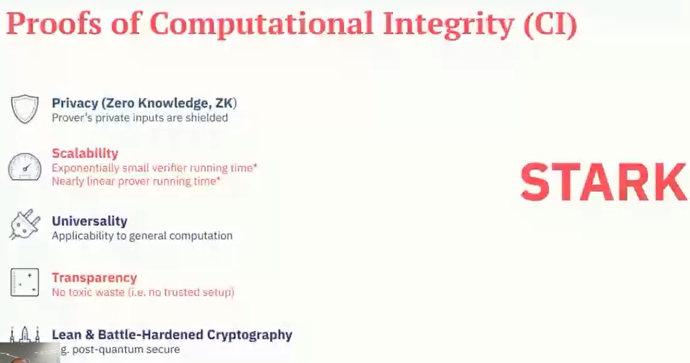
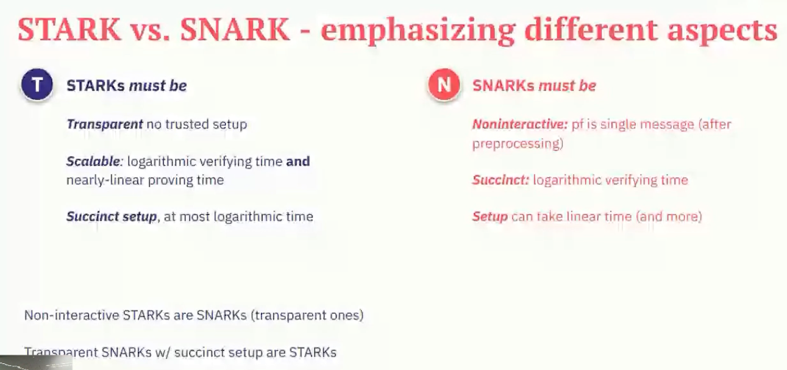

## Proofs of Computational Integrity

## General idea behind Zero-Knowledge proof

- Example of a cave (maybe where's Waldo?)
- Different introduction into ZK, not so trivial: https://youtu.be/3uSG-Xp5slM?si=fWT2JZlz6-zmSeSO

## First introduction of ZK proof

- interactive proof model by Goldwasser, Micali, and Rackoff in 1985 - https://en.wikipedia.org/wiki/Interactive_proof_system
  (also well described in https://fisher.wharton.upenn.edu/wp-content/uploads/2020/09/Thesis_Terrence-Jo.pdf pages: 4-6)

## Adjustments needed for Blockchain

### STARK vs SNARK

#### Reason for having many different implementation
They do the following things differently:

1. Method of Arithmetization 
2. Enforcement of low degreenes
3. Cryptographic assumptions used to get 2

### Characteristics of different approaches according to the classification depicted in *ProofsCI.png*

- compare the characteristics as it's done here: https://youtu.be/5y9LyTtUtwE?si=mAZmVxI8q4trI5F_

## Mathematics backstage

### SNARK

https://fisher.wharton.upenn.edu/wp-content/uploads/2020/09/Thesis_Terrence-Jo.pdf chapter 3

### STARK

#### Arithmetization

Show description and examples from: https://youtu.be/9VuZvdxFZQo?si=mVkJdfD0Re_gWND9

Proover transmits two polynomial to confirm his statement $f, g$

Validator evaluates the thow polynomials $f, g$ to verify with 99% certainty the statements of the proover.
To do it validator uses two polynomials: $C(X), D(X)$
$C(X)$ - constraint polynomial of degree $d$, which vanishes 

AIR - algebraic intermediate representation
concept for prooving the program correctness, without the need for verifier to run it

Proof recursion -> prover prooing, that it run a verifier - it can go down many times

Proof systems

#### Enforcing low-degreeness

To the right more homomorphic strucure, where you can add things
To the left more unstructured, so quantum resistance, but hard to add anything 

### Code for STARK

Jupiter notebooks with lectures to it:

https://starkware.co/stark-101/

